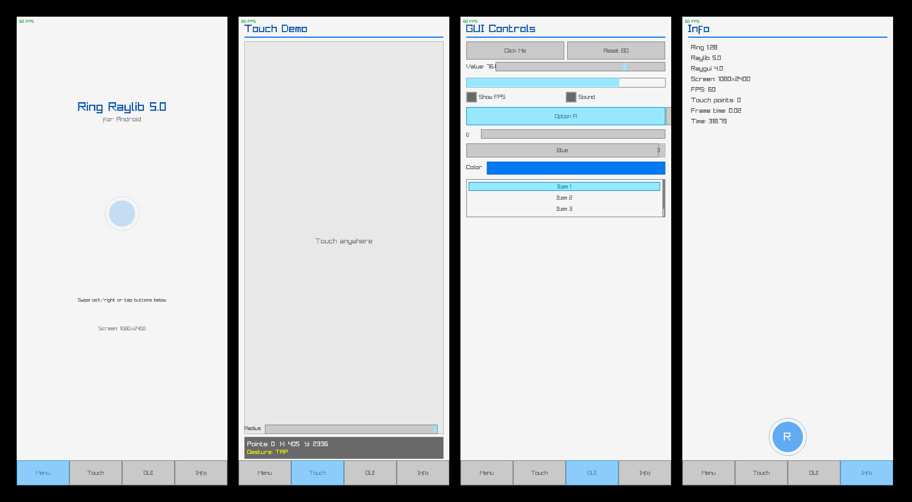

# Ring Raylib Example

A raylib + raygui demo for Android, built with [Ring](https://ring-lang.github.io/) and [ring2apk](https://github.com/ysdragon/ring2apk).



Shows touch input and gesture detection via Ring bindings over native raylib 5.5 / raygui 5.0, running in a `NativeActivity`.

## Layout

```
.
├── ring/                  # Ring sources (entry point: main.ring)
│   ├── main.ring          #   touch/gesture demo
│   ├── raylib.ring        #   raylib binding wrappers
│   └── ...
│   ├── main.c             # Android native entry, Ring VM bootstrap
│   ├── ring_raylib.c      # Ring<->raylib C extension
│   ├── raylib/            # raylib 5.5 (populated by download_deps.ring)
│   ├── raygui/            # raygui 5.0 (populated by download_deps.ring)
│   ├── ring/              # Ring language sources (compiled in)
│   └── CMakeLists.txt
├── src/java/              # MainActivity (immersive fullscreen handling)
├── res/                   # Android resources (icons, theme, strings)
├── screenshots/           # App screenshots (generated from device)
├── AndroidManifest.xml    # Custom manifest (MainActivity, AppTheme)
└── ring2apk.ring          # ring2apk build config
```

## Getting the native sources

The raylib / raygui subdirs are not committed. Fetch and extract them:

```bash
ring download_deps.ring
```

Downloads `raylib-5.5.zip` and `raygui-5.0.zip` and extracts them to `src/cpp/raylib` and `src/cpp/raygui`.

## Building

Run from the project root:

```bash
ring2apk build
```

`ring2apk.ring` configures the app (`com.ring.ringraylib`, OpenGL ES 2.0, arm64-v8a), generates the `AndroidManifest.xml` (launcher icon `@mipmap/ic_launcher` from `res/mipmap-*`), and produces the debug APK under `build/`.

## What the demo does

Four screens, switchable via the bottom nav bar or left/right swipes:

- **Menu** — animated title, swipe hint, screen size.
- **Touch** — a circle follows your finger (turns red), live touch point stats, last detected gesture (tap / double-tap / hold / swipes), radius slider.
- **GUI** — raygui controls: buttons, slider, progress bar, checkboxes, toggle group, combo box, list view.
- **Info** — Ring / raylib / raygui versions, FPS, frame time.